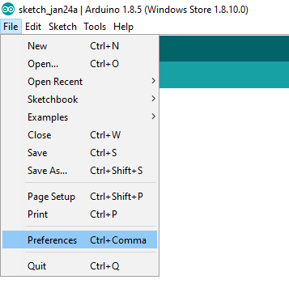
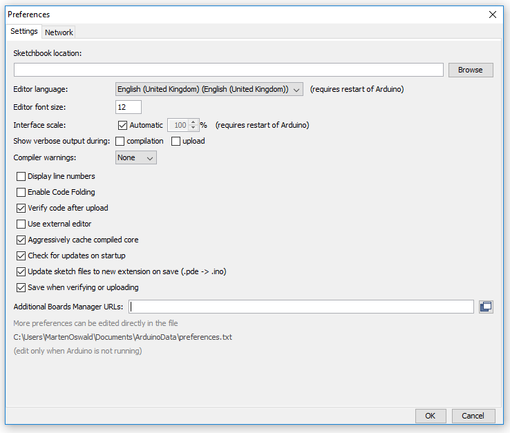
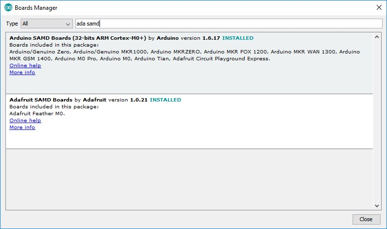
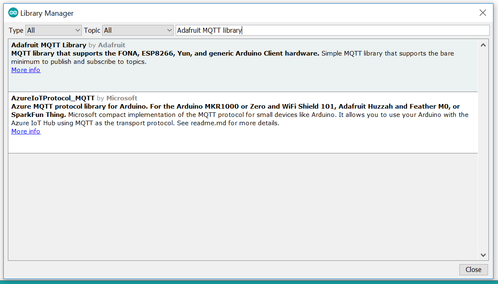

# Setting up the Arduino IDE

-------------------------------------------------------------------------------
## Installation
To install this library, if you didn't get it from the Arduino Library Manager,
just place this entire folder as a subfolder in your Arduino/libraries folder.

When installed, this library should look like:

- Arduino/libraries/dt-cot-arduino-library              (this file's folder)
- Arduino/libraries/dt-cot-arduino-library/mainpage.md  (this file)
- Arduino/libraries/dt-cot-arduino-library/src          (sources of the CoT library)
- Arduino/libraries/dt-cot-arduino-library/examples     (example reference implementations)

-------------------------------------------------------------------------------
## Arduino Basic Setup
To be able to compile the Cloud of Things library and the related examples 
the following components must be added to Arduino.

### Menu: File -> Preferences:

* Find the option "Additional Boards Manager URL" and put the following in the related text box:

https://raw.githubusercontent.com/gimasi/TUINO_ONE/master/arduino_ide/package_tuino_index.json,https://adafruit.github.io/arduino-board-index/package_adafruit_index.json,http://arduino.esp8266.com/stable/package_esp8266com_index.json

### Menu: Tools -> Board -> Boards Manager...:
Install the following board support libraries...
* Arduino SAMD Boards
* Adafruit SAMD Boards
* ESP8266
* Tuino AVR Boards

### Menu: Sketch -> Include Library -> Manage Libraries...:
* WiFi101
* Adafruit MQTT Library

